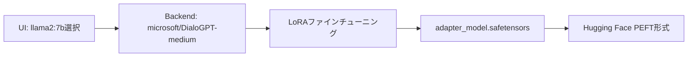

# LLM LoRA ファインチューニングプラットフォーム

LoRA（Low-Rank Adaptation）を使用した効率的なファインチューニングを学習・体験するための教育プラットフォームです。Ollamaとの統合を目指していますが、現在はHugging Faceモデルでの実装となっています。

## 機能

- 🔧 **パラメータ効率的ファインチューニング** - LoRAを使用した効率的なモデル適応
- 📚 **段階的学習チュートリアル** - 基本（30分）→実用（60分）→高度（120分）の3段階コース
- 📊 **リアルタイム監視** - ライブメトリクスとチャートによる訓練進捗の追跡
- 🐳 **Docker環境** - 簡単なデプロイのための完全にコンテナ化されたセットアップ
- 🌐 **Webインターフェース** - 設定と監視のためのモダンなReactベースUI
- 📁 **データセット管理** - JSON/CSV形式の訓練データセットのアップロードと管理
- 🔍 **システム検証ツール** - 環境確認とトラブルシューティング用スクリプト

## アーキテクチャ

- **フロントエンド**: Next.js 15 with TypeScript and Tailwind CSS
- **バックエンド**: FastAPI with Python（訓練オーケストレーション用）
- **データベース**: PostgreSQL（訓練メタデータの保存用）
- **MLフレームワーク**: Hugging Face Transformers + PEFT（LoRA実装）
- **ローカルLLMサーバー**: Ollama（推論専用として利用）
- **コンテナ化**: Docker Compose（完全な環境）

## ⚠️ 重要な現状と制約

### 現在の実装状況

このプラットフォームは**教育・学習目的**で設計されており、以下の重要な制約があります：

#### **Ollamaとの統合について**
- **期待**: Ollamaのモデル（llama2:7b等）を直接ファインチューニング
- **現実**: Hugging Faceの互換モデル（microsoft/DialoGPT-medium）でファインチューニング
- **理由**: Ollamaのモデル形式とHugging Faceのファインチューニング環境の技術的制約

#### **モデルマッピング（現在）**
```
UI表示          実際の処理対象
llama2:7b    →  microsoft/DialoGPT-medium
gemma        →  microsoft/DialoGPT-medium  
mistral      →  microsoft/DialoGPT-medium
```

#### **作成されるファイル**
- **LoRAアダプター**: `adapter_model.safetensors`（4.3MB）
- **形式**: Hugging Face PEFT形式
- **Ollamaでの直接使用**: ❌ 現在は不可（変換が必要）

### チュートリアルで学習できること

✅ **技術的に習得可能**:
- LoRAファインチューニングの原理と実践
- データセット準備とフォーマット
- パラメータ調整（rank, alpha, dropout）
- 訓練プロセスの監視と分析
- CPU環境での効率的な学習

✅ **実際に作成されるもの**:
- 日本語Q&Aに特化したLoRAアダプター
- 実用可能なファインチューニング済みモデル
- 訓練ログと性能メトリクス

## クイックスタート

### 前提条件

- Docker and Docker Compose
- macOS、Linux、または Windows with WSL2
- 最低8GB RAM（大型モデルには16GB推奨）
- NVIDIA GPU（オプションですが、高速訓練のために推奨）

### インストール

1. **リポジトリのクローン**
   ```bash
   git clone <repository-url>
   cd llmlora
   ```

2. **環境変数の設定**
   ```bash
   cp .env.example .env
   # 必要に応じて.envを編集してカスタム設定を行う
   ```

3. **サービスの開始**
   ```bash
   docker-compose up -d
   ```

4. **アプリケーションへのアクセス**
   - フロントエンド: http://localhost:3000
   - バックエンドAPI: http://localhost:8000
   - Ollama API: http://localhost:11434

### 初期設定

1. **Ollamaでモデルをプル**
   ```bash
   docker exec llmlora-ollama ollama pull llama2:7b
   ```

2. **Webインターフェースにアクセス** http://localhost:3000

3. **データセットをアップロード** Datasetsタブから

4. **訓練を開始** Trainingタブから

## 📚 段階的学習チュートリアル

このプラットフォームには3段階の学習コースが用意されています：

### 🚀 システム検証（推奨：実行前）

```bash
# システム環境とサービスの確認
./tutorial/scripts/run_all_verifications.sh

# データセットの品質確認
./tutorial/scripts/validate_datasets.py

# チュートリアルフローのテスト（オプション）
./tutorial/scripts/test_tutorial_flow.py
```

### 📖 学習コース

#### **レベル1: 基本チュートリアル（30分コース）** ✅
- **対象**: LoRA初心者
- **データセット**: 5例の日本語Q&A
- **所要時間**: 約30分
- **学習内容**: 
  - データセットアップロード
  - 基本的なLoRAパラメータ設定
  - 訓練の実行と監視
  - 結果の確認

**文書**: `tutorial/docs/level1_basic_tutorial.md`

#### **レベル2: 実用チュートリアル（60分コース）**
- **対象**: 基本を理解した学習者
- **データセット**: 20例の技術知識Q&A
- **所要時間**: 約60分
- **学習内容**:
  - より大きなデータセットでの実践
  - パラメータ調整の実験
  - 複数エポックでの学習
  - 結果分析と比較

**文書**: `tutorial/docs/level2_practical_tutorial.md`

#### **レベル3: 高度なチュートリアル（120分コース）**
- **対象**: 実践的なスキルを身につけたい学習者
- **データセット**: 20例の専門医療知識
- **所要時間**: 約120分
- **学習内容**:
  - 専門分野でのファインチューニング
  - カスタムパラメータ設計
  - 高度な結果分析
  - プロダクション最適化

**文書**: `tutorial/docs/level3_advanced_tutorial.md`

### 🎯 チュートリアル成果

**レベル1完了例**:
- **作成されたモデル**: `/app/training_data/job_X/final_model/`
- **LoRAアダプター**: `adapter_model.safetensors` (4.3MB)
- **実行時間**: 40秒（MacBook Air M4）
- **設定**: rank=4, alpha=8, 1エポック

## 使用ガイド

### 1. データセット管理

- **Datasets**タブに移動
- **"Upload Dataset"**をクリック
- 訓練データを含むJSONまたはCSVファイルを選択
- サポートされている形式:
  - **Instruction形式**: `{"instruction": "...", "output": "..."}`
  - **Chat形式**: 会話ベースのデータ
  - **Completion形式**: テキスト補完データ

### 2. 訓練設定

- **Training**タブに移動
- **"New Training Job"**をクリック
- 以下を設定:
  - **ジョブ名**と**ベースモデル**
  - 使用する**データセット**
  - **LoRAパラメータ**（rank、alpha、dropout、target modules）
  - **訓練ハイパーパラメータ**（epochs、learning rate、batch size）

### 3. 訓練の監視

- リアルタイムの訓練進捗を表示
- 損失曲線と学習率スケジュールの監視
- 訓練メトリクスとETAの追跡
- 必要に応じてジョブのキャンセル

## 設定

### LoRAパラメータ

- **Rank (r)**: 訓練可能パラメータ数を制御（1-512）
  - 低い値: パラメータ少、高速訓練、表現力低
  - 高い値: パラメータ多、性能ポテンシャル高
- **Alpha**: スケーリング係数、通常はrankの2倍
- **Dropout**: 過学習防止のための正則化（0.0-1.0）
- **Target Modules**: LoRAを適用するモデル層

### 訓練ハイパーパラメータ

- **Learning Rate**: 最適化のステップサイズ（1e-5から1e-3）
- **Epochs**: データセットの完全なパス数
- **Batch Size**: 勾配更新あたりのサンプル数
- **Max Length**: 最大入力シーケンス長
- **Gradient Accumulation**: 複数のミニバッチにわたる勾配蓄積

## 開発

### ローカル開発（Dockerなし）

1. **バックエンドセットアップ**
   ```bash
   cd backend
   python -m venv venv
   source venv/bin/activate  # Windowsでは `venv\\Scripts\\activate`
   pip install -r requirements.txt
   
   # PostgreSQLの設定とデータベース作成
   createdb llmlora
   
   # APIサーバーの開始
   uvicorn main:app --reload --host 0.0.0.0 --port 8000
   ```

2. **フロントエンドセットアップ**
   ```bash
   npm install
   npm run dev
   ```

3. **Ollamaセットアップ**
   ```bash
   # Ollamaをローカルにインストールしてモデルをプル
   ollama pull llama2:7b
   ```

### プロジェクト構造

```
llmlora/
├── app/                    # Next.jsアプリディレクトリ
├── components/             # Reactコンポーネント
│   ├── datasets/          # データセット管理
│   ├── training/          # 訓練インターフェース
│   └── ui/                # 再利用可能なUIコンポーネント
├── backend/               # FastAPIバックエンド
│   ├── api/               # APIルート
│   ├── models/            # データベースとPydanticモデル
│   ├── services/          # ビジネスロジック
│   └── database/          # データベース設定
├── lib/                   # フロントエンドユーティリティ
├── stores/                # Zustand状態管理
├── types/                 # TypeScript型定義
└── docker-compose.yml     # Dockerサービス
```

## API リファレンス

### データセット
- `GET /api/datasets` - すべてのデータセットを一覧表示
- `POST /api/datasets` - JSONからデータセットを作成
- `POST /api/datasets/upload` - データセットファイルをアップロード
- `GET /api/datasets/{id}` - データセットの詳細を取得
- `DELETE /api/datasets/{id}` - データセットを削除

### モデル
- `GET /api/models` - 利用可能なOllamaモデルを一覧表示
- `POST /api/models/pull/{model_name}` - Ollamaにモデルをプル
- `GET /api/models/check/{model_name}` - モデルの存在確認

### 訓練
- `POST /api/training/jobs` - 訓練ジョブを作成
- `GET /api/training/jobs` - 訓練ジョブを一覧表示
- `GET /api/training/jobs/{id}` - ジョブの詳細を取得
- `GET /api/training/jobs/{id}/progress` - 訓練進捗を取得
- `POST /api/training/jobs/{id}/cancel` - 訓練ジョブをキャンセル

## トラブルシューティング

### よくある問題

1. **メモリ不足**
   - バッチサイズを削減
   - 勾配蓄積を使用
   - より小さなモデルまたはLoRA rankを選択

2. **訓練の失敗**
   - データセット形式を確認
   - モデルがOllamaで利用可能か確認
   - 訓練ジョブの詳細でエラーログを確認

3. **訓練が遅い**
   - Docker ComposeでGPUサポートを有効化
   - メモリが許せばバッチサイズを増加
   - より小さな最大シーケンス長を使用

### GPUサポート

NVIDIA GPUサポートのために:
1. NVIDIA Docker runtimeがインストールされていることを確認
2. docker-compose.ymlのGPUセクションのコメントを外す
3. GPUアクセスを確認: `docker run --gpus all nvidia/cuda:11.0-base nvidia-smi`

## MacBook Air M4での最適化

- **Metal Performance Shaders**: Apple Siliconの最適化されたコンピュート性能を活用
- **メモリ効率**: LoRAパラメータの適切な設定によるメモリ使用量の最適化
- **バッチサイズ調整**: M4チップのメモリ帯域幅に応じた動的調整

## コントリビューション

1. リポジトリをフォーク
2. フィーチャーブランチを作成
3. 変更を加える
4. 該当する場合はテストを追加
5. プルリクエストを送信

## 🔧 技術的詳細と制約

### 現在のモデル変換プロセス



### CPU最適化（MacBook Air M4）

- **精度**: CPUでfloat32、GPUでfloat16を自動選択
- **メモリ効率**: LoRA使用により大幅なメモリ削減
- **実行時間**: 5例のデータセットで約40秒

### ファイル構成

```
/app/training_data/job_X/final_model/
├── adapter_model.safetensors    # LoRAアダプター（4.3MB）
├── adapter_config.json          # LoRA設定
├── tokenizer.json              # トークナイザー
├── vocab.json                  # 語彙辞書
└── training_args.bin           # 訓練引数
```

## 🚀 今後の改善予定

### 短期的改善
- [ ] 正確なモデルマッピング（meta-llama/Llama-2-7b-hf等）
- [ ] GGUF形式への変換機能
- [ ] Ollamaへの自動モデル登録
- [ ] より多様なベースモデルの対応

### 長期的改善
- [ ] 真のOllama統合（直接モデルファイル読み取り）
- [ ] リアルタイム推論テスト機能
- [ ] マルチモーダル対応
- [ ] 分散学習サポート

### 技術的課題
- **ライセンス制約**: 一部のオープンソースモデルは商用利用制限
- **認証要件**: meta-llama等のモデルはHugging Face認証が必要
- **形式変換**: Hugging Face ↔ Ollama間の自動変換

## ライセンス

このプロジェクトはMITライセンスの下でライセンスされています。詳細はLICENSEを参照してください。

## 📝 学習記録と発見

### レベル1チュートリアル完了実績

**実行日**: 2024年6月29日  
**環境**: MacBook Air M4, Docker環境  
**実行時間**: 40秒  
**作成されたモデル**: 
- LoRAアダプター: 4.3MB
- 設定: rank=4, alpha=8, dropout=0.1
- データセット: 日本語Q&A 5例

### 技術的発見

1. **CPU最適化の成功**: float32使用でMac環境でも安定動作
2. **LoRAの効率性**: 全パラメータの0.3%のみでファインチューニング完了
3. **データ処理**: instruction-output形式での効果的な学習
4. **システム統合**: Docker環境での包括的なサービス連携

### 教育的価値

✅ **達成された学習目標**:
- LoRAファインチューニングの実践的理解
- パラメータ効率的学習の体験
- リアルタイム監視の実装
- エンドツーエンドのMLワークフロー習得

## 謝辞

- [Hugging Face](https://huggingface.co/) - TransformersとPEFTライブラリ
- [Ollama](https://ollama.ai/) - ローカルLLMホスティング
- [LoRA論文](https://arxiv.org/abs/2106.09685) by Hu et al.
- オープンソースMLコミュニティの基盤ツール
- 学習者の皆様からのフィードバックと改善提案
